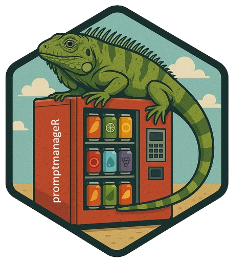

# promptmanageR  </a>

`promptmanageR` provides a simple framework for managing and rendering system and user prompts for AI/LLM workflows in R.

It helps you separate prompt logic from code — load templates from JSON files, substitute variables, and preview them interactively.

## What promptmanageR Does

`promptmanageR` does three main things:

1. **Manage and store prompts** — Organize your system and user prompts in a structured JSON file, and easily return them in an `ellmer::chat_anthropic()` or similar LLM call.

2. **Preview prompts interactively** — Quickly visualize and review the exact prompt text being sent to an LLM before execution.

3. **Pull community prompts from LangSmith Hub** — Use your `LANGSMITH_API_KEY` to download and use shared or public prompt templates directly from the [LangSmith Hub](https://smith.langchain.com/hub)

---

## 🛠 Installation

```r
# install from GitHub
remotes::install_github("lazasaurus-ai/promptmanageR")
```

---

## 🚀 Quick Start

### 1. Load prompts from a local JSON file

```r
library(promptmanageR)

# Load prompts from a local JSON file
prompts <- load_prompts("./prompts.json")

# Access a specific prompt
prompts$system_instructions1
#[1] "You are an R assistant that writes clear, reproducible code."
```


### 2. Combine with Ellmer 

```r
library(ellmer)

# Initialize a Bedrock chat session
chat <- chat_aws_bedrock(
  model = "anthropic.claude-3-5-sonnet-20240620-v1:0"
)

# Run a chat using a system prompt and a templated user prompt
response <- chat$chat(
  prompts$system_instructions1,
  render_prompt(prompts$user_template1, list(dataset_name = "iris"))
)

cat(response)
```

### 3. Prompt Preview 

You can preview any prompt template before sending it to an LLM.
This is especially useful when your prompt contains placeholders (e.g., `{{model}}`, `{{dataset}}`) that you want to substitute dynamically.

```r
library(promptmanageR)

template <- "Compare {{model1}} and {{model2}} on {{dataset}}."

preview_prompt(
  template,
  list(
    model1 = "random forest",
    model2 = "xgboost",
    dataset = "iris"
  )
)
```

Output

```r
✔ Using prompts from current R environment.

📄 Rendered Prompt:
----------------------------------------
Compare random forest and xgboost on iris. 
----------------------------------------
```
This shows you exactly what the final prompt will look like when passed to an ellmer call— helping you debug or iterate quickly on your prompt design.


### 4. Using Prompt File Setup Helper

You can quickly link your prompt file to your R environment using:

```r
use_prompt_file(scope = "project")
```
This function automatically:

* Creates (or reuses) a prompts.json file in your current project
* Adds the following line to your .Rprofile:

```r
Sys.setenv(PROMPT_PATH = "path/to/prompts.json")
```
* Ensures that promptmanageR automatically loads your prompts at startup

Typical output:

```
> use_prompt_file(scope = "project")
✔ Setting active project to "/home/username/R/promptmanageR".
ℹ File already exists at /home/username/R/promptmanageR/prompts.json
✔ Added PROMPT_PATH to .Rprofile
```

## LangSmith Support 


**promptmanageR** can connect directly to the LangSmith Hub to download and reuse community or team-managed prompts.

This allows you to pull curated prompt templates shared by the community or within your organization — all without leaving R.

### 1. Set your API key

Before using LangSmith features, set your API key in your environment.
You can do this temporarily in your R session:
```r
Sys.setenv(LANGSMITH_API_KEY = "your_api_key_here")
```
Or permanently in your `~/.Renviron` file:

```r
LANGSMITH_API_KEY="your_api_key_here"
```

### 2. Pull a prompt from LangSmith Hub

Use `pull_prompt_langsmith()` to download a prompt by its LangSmith path (e.g., `username/prompt-name`):

```r
library(promptmanageR)

prompt <- pull_prompt_langsmith("rlm/rag-prompt")

# OR LIKE THIS
# prompt <- pull_prompt_langsmith("rlm/rag-prompt",
#  api_key = Sys.getenv("LANGSMITH_API_KEY")
#  )

api_key = Sys.getenv("LANGSMITH_API_KEY")

preview_prompt(prompt)
```
And it will look like this 

```r
✔ Using prompts from current R environment.

📄 Rendered Prompt:
----------------------------------------
You are an assistant for question-answering tasks. Use the following pieces of retrieved context to answer the question. If you don't know the answer, just say that you don't know. Use three sentences maximum and keep the answer concise.
Question: {question} 
Context: {context} 
Answer: 
----------------------------------------

```

### 3. Example Workflow 

You can mix local and LangSmith prompts seamlessly:

```r
prompts <- load_prompts("inst/prompts.json")

# Use local system prompt, but remote user prompt
system_prompt <- prompts$system_instructions
user_prompt   <- pull_prompt_langsmith("rlm/rag-summary")

chat <- ellmer::chat_anthropic(
  system_prompt = system_prompt,
  user_prompt   = user_prompt
)


```

## 🌍 Universal Prompts Library

`promptmanageR` ships with a built-in `universal-prompts.json` containing reusable **assistant**, **agent**, **system**, **developer**, **teaching**, **creative**, and **governance** prompts.

Load them anytime with:

```r
universal <- load_universal_prompts()
names(universal)[1:10]
```

Example:

```r
preview_prompt(universal$developer_mlops)
```

Output:

```r
✔ Using prompts from current R environment.

📄 Rendered Prompt:
----------------------------------------
You are a machine learning operations (MLOps) engineer. Design robust CI/CD workflows for training and deploying ML models using AWS, GitHub Actions, or SageMaker. Emphasize versioning, reproducibility, and monitoring best practices. 
----------------------------------------
```
